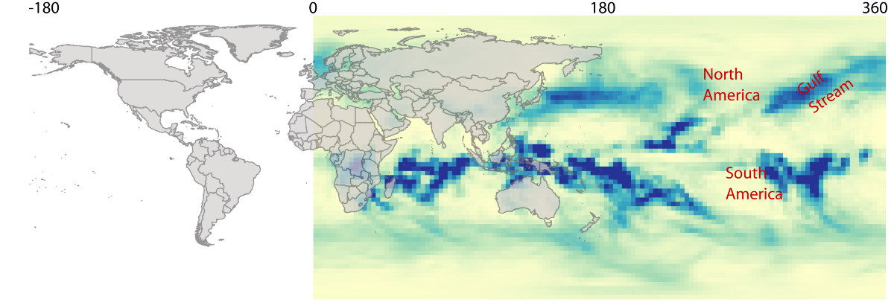

## Climate data processing
This is the documenation for the AR5 climate data processing. Most of the work was done with the R package called raster, and with Python and gdal using the osgeo4w toolset

### Converting to GeoTiff
A python script was used to pluck out the years we wanted from the netcdf and then convert them to GeoTiff. The end result was geotiff files in full time-series from 2020-2039, 2040-2059, 2060-2079, and 2080-2099. 

[Code for selecting slices of the .NC files and converting to geotiff ](https://github.com/deriggi/AR5-World-Bank/blob/master/translate.py)

### Rotating the files
Many climate models a longitudnal scale which runs from 0 -> 360 instead of the standard 0 -> -180. For these data sets we first had to rotate the data

The following image is an example of a raster that neeeds to be rotated. you will notice that you cannot simply shift the raster west because then the hemispheres would not align

[Code for Iterating through many files and rotating them](https://github.com/deriggi/AR5-World-Bank/blob/master/rotateAll.R)

### Stacking the rasters

The next step involved is stacking the rasters. Instead of having separate rasters for each year, we can us R to stack them up for easier processing. This is basically an exercise using R's stack function in the raster package. We simply grab a chuck that are of the same model, sort them, and then stack them. We have to be very careful that we are sorting them correctly!

[Code for stacking rasters](https://github.com/deriggi/AR5-World-Bank/blob/master/rasterStacker.R)

### Monthly averages

We want to show the monthly averages for each 20 year period rather than the time-series data because it is more informative. To do that we must average each month within our raster stacks.

We create a raster stack of all the January months, average the stack, write the output, and then move on to the next month.

[Code for averaging calculating monthly averages](https://github.com/deriggi/AR5-World-Bank/blob/master/monthTrender.R)

### Masking the data

We found out after processing the global files that we then needed to mask the oceans out of the rasters

[Code for masking out the oceans](https://github.com/deriggi/AR5-World-Bank/blob/master/maskOceans.R)

### Clipping each raster against a shapefile with many polygons
[Shapefiles used for this clipping activity](https://www.dropbox.com/sh/i46xxj5g3948hm7/AABVM5XPswWdA6yg8M6kHBnwa?dl=0)
To get the average for each country, we make an individual raster for each country boundary. So, we iterate through each country in a world vector file and then clip it against each raster in our dataset. Therefore the number of iterations is num_countries * num_rasters

[Code for clipping many rasters against each geom in a shapefile](https://github.com/deriggi/AR5-World-Bank/blob/master/countryClipper.py)

### Average each raster and push output into a csv file

For the API data we have to take the average of each raster and then put it into a csv file, so that it can then be loaded into the API

[Code for taking the average for a set of rasters and then putting the output in a csv file](https://github.com/deriggi/AR5-World-Bank/blob/master/averageCalculator.R)

