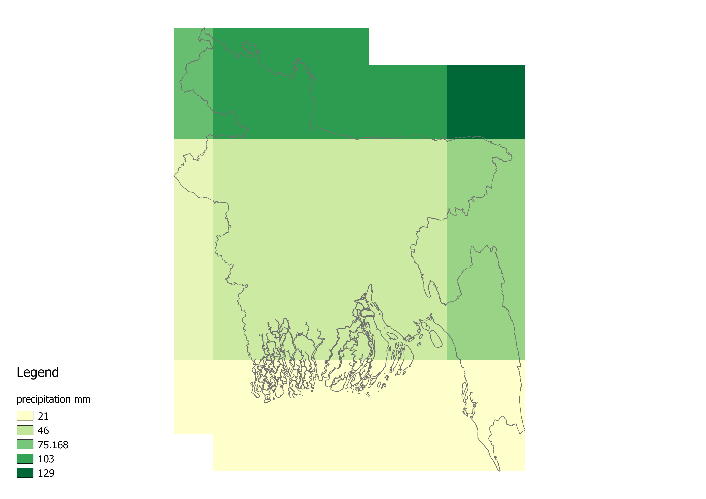

## Bangladesh Data 

pr, tas, tasmax and tasmin for the 2020, 2040, 2060, and 2080 time periods

Clipped rasters: [All Bangladesh Data](https://drive.google.com/folderview?id=0B1_qZwH-TEzpZEZkR2pMVWltWUU&usp=sharing)

